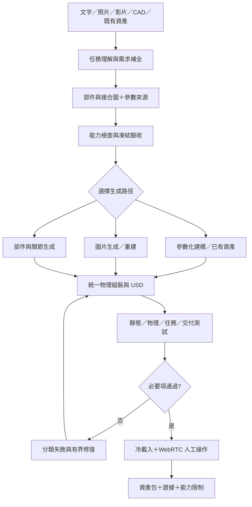

# 泛用機器人物理資產工作流：完整實作計畫

日期：2026-09-18 Asia/Taipei｜版本：1.0｜狀態：計畫完成，實作尚未開始。

本文件是接續實作的主計畫。取代早期計畫的實作排序；原始問題分析與網路調查保留為依據。
使用者本次授權為「先寫好完整計畫」，本次不安裝、不呼叫生成器、不修改物理程式、不宣稱新增能力已驗證。
以下檔名、介面、階段與門檻屬預定設計，除明列「既有」者外都尚未實作。

## 1. 目標、範圍與成功定義

讓使用者以文字、圖片、影片、CAD 或已有模型描述需要的物件，系統能：理解機器人任務、補齊必要資訊、選擇生成方法、建立被動物理資產、執行針對任務的測試，最後交付可在 WebRTC 操作的資產包。
泛化對象是「部件、接合、材料與行為」，不要求預先枚舉所有商品。紙箱、包杯、包裹是回歸案例，不是架構的限定類別。
主要改善指標是首次生成後的必要測試通過率、關鍵需求漏失、人工修正輪次與總交付時間；不承諾任意物件零迭代。

兩個交付範圍：
- **V1 基礎工作流**：通用契約、預處理、測試選擇、既有參數化路徑、一條外部圖片生成路徑、剛體與既有摺痕代理、冷載入與 WebRTC。它不能被宣稱為完整柔性拆包方案。
- **V2 複合包裝能力**：經最小實驗證明可用後，逐项增加膜／板彎曲、緩衝壓縮、黏著剝離、塑性或損傷，再驗證組合解包。未通過的能力保留 blocked／not_tested，不用假模型填滿。

非本輪範圍：建新網站／資料庫／常驻服務、換掉 Isaac、完整 RL 訓練、導入 ROS、新購硬體、一次安裝全部研究框架。機器人控制整合另外開卡；本計畫先提供可受外力與接觸操作的資產介面及夾具測試。

## 2. 不可妥協的行為契約

1. 資產是被動物件：接觸、重力、外力與材料定律決定狀態；不得用開／關按鈕、角度動畫或每步改 pose 冒充操作。
2. 材料 callback 可以根據變形歷史更新塑性角或損傷，但不能驅動到預先指定的開箱姿勢。測試施力器與資產程式分開。
3. 生成器不得縮小 probe、關閉必要碰撞、調寬驗收或刪除必要功能讓結果過關。
4. 沒有來源的材料數值是估計；AI 推斷、文獻類比和真實校準分開。隨機化不能代替校準。
5. USD、runtime、錄製動畫三者用途分開。需要 runtime 才有的行為必須隨包交付，缺 runtime 時禁止宣稱該行為已啟用。
6. 未測、缺能力、測試失敗與人工確認待完成分開呈現；生成出檔案不等於驗證。
7. 本機版本與環境不變；任何外部工具只在隔離環境以檔案交接，不安裝進 Isaac 共用 venv，不停止他人程序。

## 3. 既有資產與需保留的基線

現況來自既有紀錄，本次未重跑：
- S0–S4 基礎資產與驗證、S5 官方 adapter／證據／影片／部分 bounded repair，詳見 ROADMAP。
- exports/carton_v1：自由箱體、四片剛板蓋、塑性摺痕 runtime；D068 記錄匯出讀回。
- 紙箱板面 MD/CD 變形、凹陷、壓潰與撕裂仍未模擬；材料仍未實物校準。
- scripts/pf-video-background 已有背景工作機制，沿用，不另開影片系統。
- reports/development、reports/execution、runs 既有目錄沿用。
- 官方上游固定在 config/upstream_content_agents.json 指定 commit；網頁的新功能不代表本機已可用。

開始實作第一張卡時，先在新 runs 保存 git status、環境、GPU 資源檢查，執行 ./scripts/pf smoke 建立新基線。
若 GPU 不足，記錄 blocked，不清掉別人資源；離線契約工作可繼續，但不得聲稱物理回歸通過。

## 4. 使用者實際會經歷的流程

使用者可說：「照這張照片做一個包裹，讓機器人拆開取出裡面的物件。」
系統先讀已有資訊，產出需求摘要與缺口，只集中確認少數對結果有影響的問題：
- 要搬運、開蓋、解包、剝膠帶、壓凹或撕破哪些動作？
- 初始是封好還是膠帶已拆？外包裝內有什麼？
- 尺度／重量是否有資料？箱體或內容物能否自由移動？
- 要驗證特定實物，還是接受有來源的合理參數範圍？

每批通常以 3–5 個語義問題為目標，資料充分時不問。必要問題未答保留 needs_input；低風險項列明預設。不能把使用者沒有回覆當成同意改任務。
不讓使用者自行填完整彈性模數／塑性黏度表。系統負責把「小力回彈、大力留摺」轉成量測目標與參數提案。
查不到真值時，交付假設及不確定範圍；若關鍵行為不能由資料辨識，明示需要影片、量測或縮小宣稱，而非繼續猜到 pass。
完成後只需開交付包的 WEBRTC.md，使用已測指令載入，依操作卡做兩三個小實驗。

## 5. 架構與資料流



不建立需要常驻伺服器的「大系統」。優先在現有 Python／腳本增加模組和檔案契約。
模組責任預定如下，P0 需對照現有目錄後確定實際檔名：

| 模組 | 責任 | 不得做的事 |
| --- | --- | --- |
| intake／research | 理解任務、整理來源、提出必要問題 | 把查得值自動升格為實測 |
| contracts／capabilities | 規格驗證、部件關係、模型適用範圍 | 默默補齊未知能力 |
| providers | 呼叫選定生成器、保存版本及產物 | 修改驗收 profile |
| assembly | visual／collision／physics 對齊、單位、材料、接合 | 把外觀 mesh 等同物理模型 |
| validation | 依 task＋behavior 選測試、量測與判定 | 用生成器自述取代結果 |
| repair_guard | 控制允許變更、預算、來源綁定 | 覆蓋原始失敗證據 |
| delivery／runtime | 匯出、初始化、reset、生命週期、WebRTC 入口 | 以動畫假裝 live |

## 6. 通用資料契約

採可版本化的 JSON／Markdown 檔案，不先引入新依賴。必要結構在 P0 設計、驗證器在後續卡實作。

| 產物 | 最低必要內容 |
| --- | --- |
| input_manifest.json | 輸入型態、路徑／hash、來源權利資訊、尺度參考、擷取條件 |
| task_brief.json | intended_task、動作、成功觀測、初態、載荷／速度範圍、固定／自由條件、robot_interface 需求 |
| assembly_graph.json | 穩定 part ID、座標系、材質、接合／接觸邊、父子與包覆關係、可接觸／抓取區域 |
| parameter_cards.json | value/range、unit、provenance、source、條件、信心、推導、校準狀態 |
| capability_report.json | 行為需求、候選模型、本機版本支援與證據、未覆蓋項、效能／runtime 限制 |
| asset_contract.json | schema_version、任務／圖／參數版本、必要能力、可接受近似、禁止簡化、交付範圍 |
| validation_plan.json | required check IDs、前置條件、夾具、觀測量、參考、容差理由、成本、適用性 |
| provider_request/result.json | provider/version/model/seed、輸入 hash、資源／時間預算、status、輸出檔／hash、錯誤、使用費資訊 |
| validation.json | 每項 result、observed/reference、coverage、evidence path、未測原因 |
| delivery_manifest.json | 包內檔案／hash、環境、依賴、支援行為、操作入口、reset／resume 語義與限制 |

ID／units／finite 值／引用完整性／必要欄位／未支援 schema version 都需驗證；同一 schema 名不得對應兩種格式。
欄位更名採顯式 migration，舊 run 不修改。part IDs 經生成、USD prim、量測及修復保持可追蹤。

部件例子僅示意：carton、flap_major_1、wrap_sheet、tape、payload；邊代表 hinge、adhesion、contact、containment。
能力採開放的 registry，例如 rigid_contact、revolute_passive、plastic_crease、shell_bending、compressible_layer、peelable_bond。
名稱未知或必要能力沒有測試配方時硬性拒絕「可交付」判定，輸出缺口，不只按物件名稱選模板。

## 7. 預處理、查證與不確定性

流程：解析已有資料 → 搜尋適用來源 → 部件／界面分解 → 找關鍵未知 → 集中確認 → 凍結需求與測試。
先檢索既有案例和来源快取；同一材料名稱不代表型號、厚度、溫濕度、方向與載入歷史相同。
provenance 分 user_given、measured、manufacturer、literature_matched、literature_analogy、derived、assumed、unknown。
文獻需記材料、試片尺寸、MD/CD、載入速率、循環、單位和適用條件；來源衝突保留候選及選擇理由。

對圖片必查尺度、遮蔽、內腔與薄結構。只有單張圖時，不把猜出的背面／接縫標成已觀測。
對包材分開 film thickness、bubble height、areal mass、collision offset、compression response。
對黏著分開剝離角度／速率與剪切；不同基材的數據不能直接互換。
衍生參數保留公式與來源；相關參數一起變動，避免厚度、密度、總質量互相矛盾。
校準需同時識別參數可辨識性：多組參數都能配合同一終態角時，增加載入／卸載／不同速度曲線，不宣稱已唯一識別。

## 8. 生成路徑與選用條件

| 路徑 | 適用條件 | 採用策略 |
| --- | --- | --- |
| 已有 CAD／資產 | 有尺寸、部件或供應商模型 | 優先重用並驗證尺度、內腔、碰撞、授權 |
| 參數化程式 | 規則形狀、板厚、摺線、接合主導 | 保留現有生成器；借 LL3M 的可編輯建模思路 |
| 圖片到 3D | 複雜外觀、初始缺幾何 | EmbodiedGen 單物件路徑先做資格測試；其既有圖片後端只選一個 |
| 部件／articulation | 確實需要獨立可動零件 | Articulate-Anything／PartCrafter 作候選，輸出仍需物理組裝 |
| 實物辨識 | 需要符合某一實物的動態 | 参考 Scalable Real2Sim／PhysTwin，另開資料採集／辨識卡 |
| 新柔性機制 | 本機現有模型無證據 | 先能力探針，PhysX-Omni／DeformSmith 等僅供研究與比較 |

EmbodiedGen 是首個候選，不是已選定永遠唯一後端。TRELLIS.2、SAM 3D、Hunyuan 作備選；不假設某版本 adapter 已支援另一模型版本。
資格測試需查固定 commit／權重、授權、依賴、可用 GPU、無人值守入口、輸出格式、所需服務及下載成本。
PhysX-Omni 有非商業授權條件，未確認公司用途授權前不作生產依賴。其他工具分別檢查 code、weights、datasets 和依賴條款。
外部 backend blocked 時可以完成契約與本地路徑，但該圖片能力仍 blocked；不能改用本地盒子並聲稱圖片生成已完成。
不把論文基準的速度或跨 simulator 格式轉換等同本機效能或行為等價。

## 9. 幾何到物理的組裝

每件資產分 visual mesh、collision representation、physical model 三層，建立可追蹤對應。
匯入先檢查尺度／up axis／transform／拓撲／部件／內腔；尺度變換後重新計算質量或慣量，不只縮放外觀。
碰撞近似必須保留任務可達空間：杯口、把手孔、薄片、開口不可被整體 convex hull 封死。
接合檢查 local frame、axis、body relationship、limit 世界幾何、初始穿透和可達範圍。

物理數值在本機讀回：mass、COM、inertia、drive mode／units、friction、restitution、thickness、collision filters。
材料顯式設定；runtime fallback／default 必須報出，不沿用「模擬器預設就是紙板」的假設。
rest shape、預張力、裝配暖機與塑性歷史需保存；暖機後恢復目標參數，並測冷載入是否仍代表同一狀態。
數值不穩先定位初始化、接觸、離散化與積分設定，不暗增質量或降低材料勁度。必要近似要另版規格並報物理偏差。

## 10. 驗證與判定

| 層 | 內容 | 代表歷史回歸 |
| --- | --- | --- |
| 結構 | 契約、USD、units、引用、碰撞、質量／慣量可行性 | 共用 schema 名卻格式不同、杯口被封 |
| 讀回 | authored 與實際解析值比較、比較項數完整 | 變數遮蔽導致勁度未被檢查、預設摩擦 |
| 材料 | coupon、解析對照、加卸載、循環、速度影響 | 強回彈、薄膜冒充緩衝 |
| 任務 | 裝配後接觸施力、自然阻擋、自由箱體、可拆性 | 小蓋被大蓋擋住、封閉袋替代可拆包裝 |
| 數值 | dt／mesh／solver 敏感度、重複 run、穿透／能量異常 | 分段板抖動、初始穿透爆炸 |
| 執行 | 冷載入、pause/reset/reload、內部狀態、callback 去重 | import 快取、USD 缺塑性程式 |
| 交付 | 真實 viewer 入口、拾取／施力、人工小實驗 | 動畫當 live、拖到整箱、視覺泡泡不跟隨 |

共用測試的觀測介面可以重用，幾何查詢仍需符合真正物件形狀；不能以紙箱 AABB 假裝任意容器內腔。
每項有独立觀測與參考，不能只是「生成器算出 x、測試再呼叫同一函式得到 x」。
容差在生成前訂好；來源為量測誤差／任務要求／數值收斂目標，缺依據時先訂 qualification 實驗，不能看結果後調到剛好 pass。
同規格下未知必測項、runtime 缺失、未執行 check、缺觀測資料，均不能出現整體 pass。

單項狀態：pass、fail、blocked、not_tested；不適用僅限非必要項且需理由。superseded 只描述舊需求版本，不是 pass。
資產報告分開 physical_execution、state_readback、headless、render、human_webrtc、real_world_calibration。
自動 gate 通過但人工尚未看：ready_for_human_review。人工未確認不得寫 delivered_verified。
未校準的假設資產可作探索交付，但 suitability 標為 assumed_physics；不能用 overall pass 掩蓋未驗實物。

## 11. 修復、執行恢復與資源

錯誤先分：requirement_conflict、unsupported_capability、provider_failure、geometry、physics_authoring、numerical、validator_bug、viewer/runtime。
需求矛盾／模型缺能力先回規格提案；provider 故障重試不能算物理修復成功；UI 故障不能靠調軟材料處理。
預設規劃最多三次自動修復，沿用並稽核現有 repair guard／budget；每個 attempt 使用新 run，綁 spec/profile/source hash。
改驗收或需求不是 repair，需顯式新版本；validator bug 保留失敗證據和修正理由，另做負向測試與重判。

流程可從已完成且 hash 未變的產物繼續；輸入／模型／規格改變則相關下游結果失效。
流程恢復和物理狀態恢復分開：沒有 solver／材料歷史保存能力時，從初態重跑，不聲稱中斷後接續物理等價。
生成、物理、影片使用有界 job；每項保存 started/completed/failed/blocked、exit code、時間和 stderr。
已排背景影片不得重複渲染同一來源；失敗／stalled 明確報告，不阻塞必要物理工作。
無空閒 GPU 記錄 blocked，讀取型工作可繼續；不重啟他人 WebRTC 或占用其 49100/47998。

## 12. 匯出包與 WebRTC 驗收

預定交付結構（尚未建立通用 exporter）：

```text
exports/<asset-id>/
  asset.usda
  meshes/  textures/
  config.json
  runtime/                 # 僅需要時；含版本及材料狀態定義
  load_in_isaacsim.py
  delivery_manifest.json
  capabilities.json
  validation_summary.json
  WEBRTC.md
  README.md
  media/                   # 選用；標示錄製來源 run
```

所有外部引用可移動；複製到新的測試目錄後執行真入口，保存 physics readback 和結果。
loader 必須處理 Script Editor 的 __file__ 缺失、module cache、async 例外、stage 生命週期、callback 清理及重複執行。
包自身不能偷偷改全域環境、接管 viewer 或啟用未授權 extension；需要的能力不存在就診斷 blocked。
每次載入顯示 asset ID、來源 run、實際模型種類、runtime 狀態和能力缺口，避免再次操作到舊版本。

WEBRTC.md 必有：
- 適用的 Isaac／viewer 版本、實際測过的載入指令和前置條件。
- 保存現有工作、載入、Play、定位、拖曳／接觸操作、Reset、停止與卸載。
- 操作位置、預期反應和失敗診斷；不依記憶猜快捷鍵或把 pickingForce 單位宣稱為 N。
- 每次教一個概念、做一個只改一個參數的實驗。紙箱以拉動幅度比較回彈；軟層以壓入程度比較反應。
- 數字、人工觀察和已知限制分開；板面是剛板時不提供「敲打會凹」的指示。

無 headless 圖像能代替真人 WebRTC 確認。AI 不宣稱自己看過圖像；渲染自動 gate 保存影像統計，平黑畫面獨立記錄 render failure。
影片在關鍵里程碑與修复前後才背景錄製，保留物理軌跡來源，不每次 commit／test 都重錄。

## 13. 階段任務與完成條件

P0–P5 是 S5/S6/S7 與 EXT2 的工作拆分，不新增與原路線競爭的第二套專案進度。一次只執行一張有界卡。

| 卡／依賴 | 預定工作與產物 | 完成條件與下一步 |
| --- | --- | --- |
| P0：先做 | 通用資料契約草案、能力圖、來源格式、歷史事件→需求→check 對照、provider 資格卡 | 紙箱、包杯、不規則剛體、未知能力四種規格可完整描述；所有重大歷史失敗都有對應防線；下一步 P1 |
| P1：P0 | 預處理、來源檢索／快取、集中確認、needs_input／ready 判定 | 短 prompt 可產生缺口；未確認關鍵量不進生成；來源可追溯；不需要每個物件新寫問卷；下一步 P2 |
| P2a：P1，EXT2 | explicit registry、task/behavior 選測試，適配現有 box runner | 舊案例 verdict 不變；未知必測项／未執行 check 不能 pass；每項選擇理由入證據；下一步 P2b |
| P2b：P2a | 第二幾何家族與故障注入，釐清觀測／幾何介面 | 同任務重用測試，保留真內腔判定；錯 units/mass/collision/runtime 可被抓到；下一步 P3a |
| P3a：P2 | EmbodiedGen 單物件資格檢查與隔離 adapter；限定一個圖片後端 | code/model/licence/resource/CLI 均確認；實際輸出可轉 USD；失敗不偽造替代完成；下一步 P3b |
| P3b：P3a | 一個不規則剛性物件 end-to-end；與參數化／已有資產比較 | 尺度／碰撞／mass 讀回、落地與接觸通過；保存首次結果與修復次數；下一步 P4a |
| P4a：P3b | 通用 export／live loader／生命週期／人工操作卡 | 新目錄冷載入、reload/reset、runtime 診斷通過；使用者完成小實驗或明列待人工確認；V1 交付 |
| P4b：P4a | 可動部件候選或既有摺痕接入同一契約 | 部件獨立、力驅動、碰撞阻擋合理、舊紙箱回歸通過；不冒稱材料已校準 |
| P4c：P4b | 一次一種柔性／接合能力：板彎曲→軟層壓縮→可剝離接合，依任務選最先必要者 | 各自有 coupon、裝配、數值與 cold-load 證據；失敗維持缺口，可換模型但不刪需求 |
| P4d：必要 P4c 通過 | 複合包裹任務：接觸、分離、取出內物 | 原先可拆／可壓／可彎要求逐一對應 evidence；缺任一必要行為不得宣稱完整拆包；V2 候選 |
| P5：V1 後先做，V2 後擴充 | 相同條件新舊流程比較、保留案例、handoff | 結果含成本／輪次／coverage／誤判／人工操作；限定適用範圍，決定何者可成為預設 |

每卡開始前讀 STATE、相關 task、最新 session，確認前卡 evidence；每卡完成後寫建置報告與可執行驗證命令。
若某卡超過本身範圍，新增後續卡，不把 registry 重構夾入材料破壞或整個訓練框架。

## 14. 比較實驗與發布門檻

建議小型資格評測：四種不同機制，每個候選路徑先三次生成／執行；這只是工程初篩，不足以宣稱統計優越。
案例包含不規則剛體、可動容器、柔性包覆硬內物、未參與調參的保留案例。V1 對柔性案例應正確報能力缺口。
後續擴大樣本量由觀察到的變異決定；報每案例、每次 run 及分母，不只平均成功率。

| 指標 | 定義 |
| --- | --- |
| 首次生成通過率 | 需求凍結後第一次產物通過該 scope 所有必要機器測試的比例 |
| 必要能力覆蓋率 | 有執行證據的必要能力／全部必要能力，與通過率分開 |
| 錯誤通過 | 已知故障被判 pass；資格負向案例要求 0 個，但不宣稱真實世界零誤判 |
| 人工成本 | 必要澄清批次、人工修正次數／時間；不把內部 agent 對話混成使用者輪次 |
| 計算成本 | provider/API、生成、修復、物理、render 各自時間／費用／VRAM；首次 setup 和暖快取分報 |
| 交付成功 | 冷載入、讀回、live 操作及人工確認分別計數 |
| 實物一致性 | 有對照量測才評；缺實物記 not_tested，不混進幾何成功 |

比較固定 input、資訊量、驗收、修復預算；能固定 provider/model/seed 就固定，無法相同者明列混雜因素。
僅通過生成器資格測試不代表能當預設。成為預設前需完成該 scope 回歸、negative tests、冷載入、授權檢查與使用者操作。
不先承諾效率百分比、完成百分比或截止日；第一個端到端樣本後，以實際分段耗時估下一卡。

## 15. 報告、證據與進度

工作流建置進度：reports/development/<date>_<milestone>.md。
每個物件運行進度：reports/execution/<run-id>.md。
原始資料與命令輸出：runs/<run-id>/，append-only；修復、重測、重新生成使用新 ID。

建置報告固定列本卡範圍、變動、來源、已執行命令／exit、證據連結、人工操作、尚未完成、下一步。
執行報告固定列目前階段、輸入版本、已通過／失敗／blocked／未測、所需輸入、產物與 runtime 狀態。
不以檔案或測試數量作完成率。先用卡狀態與具體能力報進度；必要時百分比只能描述事先定義的同一 scope，不能含未完成材料能力又稱整體完成。
照片／影片連結附來源 run 和成功／失敗狀態。無圖的規格階段用需求表作證據，不為湊報告製作影片。

## 16. 主要風險與處理

| 風險 | 處理與停止条件 |
| --- | --- |
| 外部模型裝不起來／API 不可用 | 隔離資格測試；保留 blocked；不改 Isaac 依賴 |
| 圖片生成缺內腔或部件 | 依需求回 parametric／CAD 或要求更多觀測，不只修外觀 |
| 物理真值不足 | 來源範圍＋敏感度；特定實物宣稱需量測 |
| 本機不支援所需柔性／接合 | 能力探針失敗即停止該能力線；提出替代模型及偏差供判定 |
| 為穩定性暗改物理 | 保存參數 diff／質量收支；超允許修復範圍拒絕 |
| 測試自我循環／critic 誤判 | 獨立觀測、解析／實測對照、負向案例；critic 不得覆蓋硬失敗 |
| WebRTC 與 headless 行為不同 | 真 viewer 入口驗證，明列人工 pending；不把射線代理當真人操作 |
| 文件版本矛盾 | STATE 只放最新摘要；原始 history 不刪，最新契約及 evidence 指明 superseded |
| 授權／相依模型條件不明 | 未釐清前不納公司交付依賴；選可接受替代來源 |

## 17. 來源與採用界線

本計畫的組合架構、任務拆分與 gate 是專案設計；下列提供方法或工具依據，不宣稱全部已重現。

| 來源 | 採用內容／界線 |
| --- | --- |
| [NVIDIA USD Content Agents](https://github.com/NVIDIA-Omniverse/usd-content-agents) | 保留 pinned adapter、工具及證據，不重寫全框架 |
| [NVIDIA SimReady FAQ](https://docs.omniverse.nvidia.com/simready/latest/simready-faq.html) | 靜態資產檢查與 runtime 行為測試分開；最新套件不自動適用本機 |
| [EmbodiedGen](https://github.com/HorizonRobotics/EmbodiedGen) | 外部單物件生成候選；估計物理值不當作校準 |
| [LL3M](https://github.com/threedle/ll3m)／[Articulate-Anything](https://github.com/vlongle/articulate-anything) | 可編輯程式建模／可動部件推斷；不是材料真值來源 |
| [Scalable Real2Sim](https://arxiv.org/abs/2503.00370)／[PhysTwin](https://github.com/Jianghanxiao/PhysTwin) | 互動量測與辨識方向；需要真實資料及目標模型適配 |
| [OpenUSD DriveAPI](https://openusd.org/release/api/class_usd_physics_drive_a_p_i.html) | drive 與目標／材料內部狀態邊界；本機單位另讀回 |
| [ISO 5628:2019](https://committee.iso.org/standard/76347.html?browse=ics)／[ASTM D1596](https://store.astm.org/d1596-14r23.html) | 板彎曲／包材緩衝試驗方法参考；本次未執行完整標準試驗 |

完整候選、授權及公開能力查證：[專案調查](../research/2026-09-18_asset_generation_landscape.md)。
歷史失敗對照及原始需求：[前期計畫](2026-09-18_task_driven_asset_workflow.md)第 3 節；材料來源位於 docs/research/。
重大事件包含 D060–D068 與兩份使用者附件。來源快照、日期與 hash 於實作時納入 run。

## 18. 下一次開始的唯一動作

執行 [P0 任務卡](../tasks/WF_P0_contracts_and_capabilities.md)：先建立通用契約／能力圖及歷史需求對照，以四種案例檢查能否表達；同時寫出首個 provider 資格測試規格，但不在 P0 安裝生成器。
本次只完成計畫與該卡，P0–P5 實作全部仍為 todo。

## 使用者驗收補充：整體可移動（2026-09-18）

機器人包裹預設 free dynamic，必測 structure.mobility：无世界／靜態錨定關節鏈、實際剛體 enabled、外力位移。不能用固定試片替代 robot prop 交付。
固定实验可单独存在，但不應由 live loader 回退載入；原位 containment 檢查须轉箱體局部座標。
單一 keyboard 示例已验证 generator／直接世界joint／推力位移；通用間接錨定分析尚未實作。
